### 🧩 Proyectos

| Proyecto | Qué hace |
| --- | --- |
| **[AzkenOS](https://github.com/FalconAkantor/AzkenOS)** | Sistema operativo *live* con drivers y CUDA de NVIDIA: lanza benchmarks y usa IA para detectar fallos de hardware, sin instalar nada. |
| **[KcalorIA](https://github.com/FalconAkantor/KcalorIA)** | Mandas una foto de tu comida por WhatsApp y recibes calorías, macros, una puntuación, consejos y un PDF para guardarlo. |
| **[WebIADetection](https://github.com/FalconAkantor/WebIADetection)** | Detección de objetos con YOLOv5 en tiempo real, con panel web en Flask y avisos al momento. |
| **[DetectIAPerson](https://github.com/FalconAkantor/DetectIAPerson)** | Detección de personas con YOLOv5 en vídeo o cámaras en directo, con alertas por Telegram. |
| **[WatchPort](https://github.com/FalconAkantor/WatchPort)** | Monitor de tráfico de red con Scapy que avisa por Telegram de conexiones sospechosas. |
| **[GeoIpTelegram](https://github.com/FalconAkantor/GeoIpTelegram)** | Informe por Telegram de las IPs conectadas a un servidor: país, ciudad e ISP. |
| **[NmapTelegramScan](https://github.com/FalconAkantor/NmapTelegramScan)** | Escanea la red local con nmap y avisa por Telegram de qué dispositivos entran y salen. |

  <a href="https://falconakantor.github.io/Portfolio/es/"><b>🌐 Portfolio</b></a>
  &nbsp;·&nbsp;
  <a href="mailto:nacho.automariza@gmail.com"><b>✉️ nacho.automariza@gmail.com</b></a>

Las animaciones son SVG generados por <code>scripts/</code> y se actualizan solas cada día con GitHub Actions.

